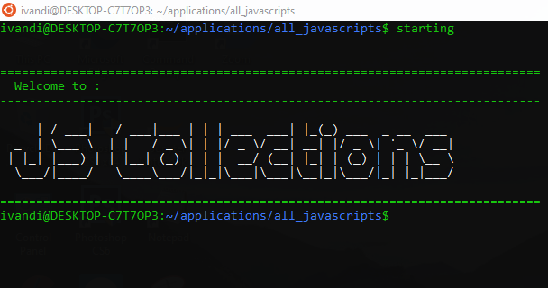

## ALL JAVASCRIPT COLLECTIONS

### About

`ALL JAVASCRIPT COLLECTIONS` is Command Line Interface (CLI) Application which is use to see `Algoithm` and `Data Structure` Coding Challenge Solution .



### Getting Started

To getting start with this Application, simply clone this repository by running this command below

```
git clone https://github.com/ivandi1980/all_javascripts.git
```

or you can directly download the zip file by clicking the download button on the top right side of this repository.

### Installation

After you clone or download this repository, just run this command below

Navigate to the Folder `all_javascripts`, then type this command below

```
npm install -g .
```

Note : Don't forget adding DOT (.) after -g

wait until the installation finish.

### Run the Project

To running this project, simply type this command below on your favourite Terminal

```
starting
```

Then, it would showing you the `Welcome Screen`.

### Error on Windows

This is a special `Case Error` happen in windows, if face an error like this below :
`File C:\Users\admin\AppData\Roaming\npm\ng.ps1 cannot be loaded because running scripts is disabled on this system. For more information, see about_Execution_Policies at https:/go.microsoft.com/fwlink/?LinkID=135170.`

what you've to do is :

First, you have to need to open the command prompt and run this command and Execute this command :
`set-ExecutionPolicy RemoteSigned -Scope CurrentUser `

Now you have to run the second command on your system. This command is:
`Get-ExecutionPolicy`

To view their policy, you need to run this command in your command prompt:
`Get-ExecutionPolicy -list`

Good Luck, and Have a niceday!

### Credit

```
Package Name : ALL JAVASCRIPT COLLECTIONS
version : 1.0.0
Author : Ivandi Djoh Gah
Date : August 22, 2021
Stack : Javascript (ES6)
dependencies : chalk, figlet, inquirer, prompt-sync

```
